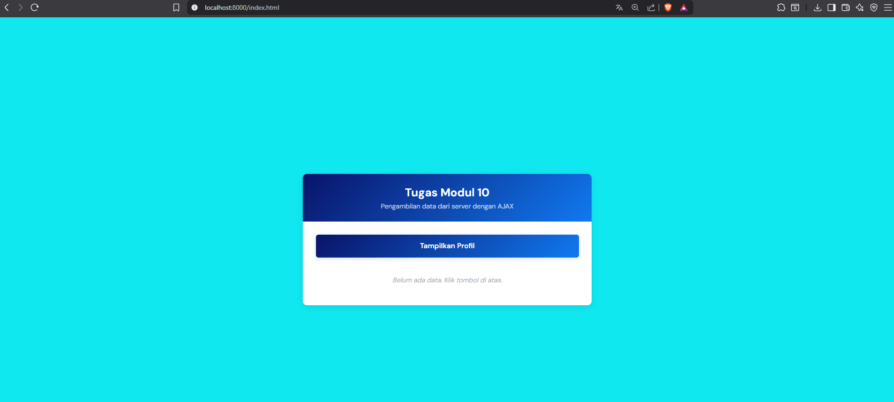
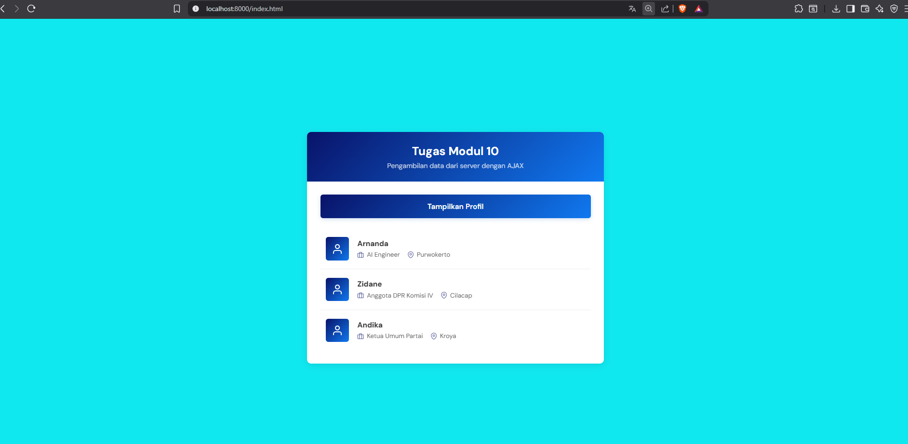
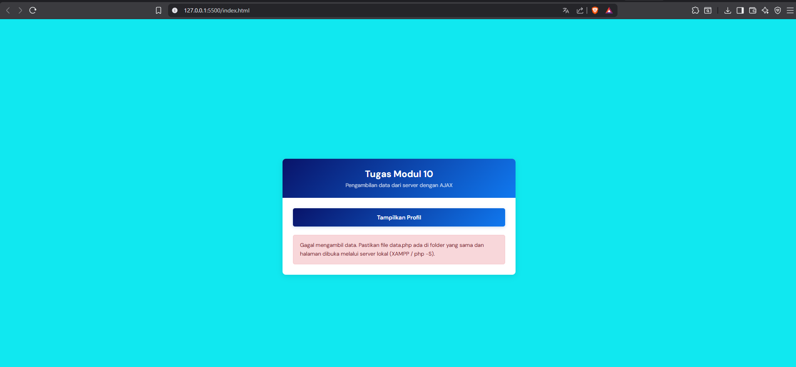

<div align="center">
  <br />

  <h1>LAPORAN PRAKTIKUM <br>
  APLIKASI BERBASIS PLATFORM
  </h1>

  <br />

  <h3>MODUL - 10<br>
  AJAX
  </h3>

  <br />

  

  <br />
  <br />
  <br />

  <h3>Disusun Oleh :</h3>

  <p>
    <strong>Arnanda setya nosa putra</strong><br>
    <strong>2311102180</strong><br>
    <strong>S1 IF-11-04 </strong>
  </p>

  <br />

  <h3>Dosen Pengampu :</h3>

  <p>
    <strong>Cahyo Prihantoro, S.Kom., M.Eng.</strong>
  </p>
  
  <br />

  <h3>LABORATORIUM HIGH PERFORMANCE
 <br>FAKULTAS INFORMATIKA <br>UNIVERSITAS TELKOM PURWOKERTO <br>2026</h3>
</div>

---

## 1. Dasar Teori

### Pengertian AJAX

AJAX (Asynchronous JavaScript and XML) adalah teknik dalam pengembangan web yang memungkinkan aplikasi berkomunikasi dengan server tanpa perlu melakukan reload seluruh halaman. Meskipun namanya mengandung XML, saat ini AJAX lebih sering menggunakan JSON (JavaScript Object Notation) karena lebih ringan dan mudah diproses oleh JavaScript. Dengan AJAX, tampilan aplikasi menjadi lebih smooth dan responsif karena hanya sebagian halaman yang diperbarui.

### Cara Kerja AJAX

AJAX bekerja secara asynchronous, sehingga JavaScript tetap bisa menjalankan kode lain sambil menunggu respons dari server. Berikut alur kerjanya:

- `Trigger Event`: _User_ melakukan aksi (misal: klik tombol)
  Create
- `XMLHttpRequest/Fetch`: Browser membuat objek untuk mengirim _request_
- `Send Request`: _Request_ dikirim ke _server_ (GET/POST)
- `*Server* Process`: _Server_ memproses _request_ dan mengembalikan data (biasanya JSON)
- `Response Handling`: JavaScript menerima _response_ dan memperbarui DOM

### Fetch API

_Fetch API_ adalah _interface_ modern JavaScript untuk melakukan _request_ HTTP yang menggantikan _XMLHttpRequest_. _Fetch_ menggunakan _Promise_ sehingga kode lebih bersih dan mudah dibaca. Sintaks dasarnya adalah `fetch(url)` yang mengembalikan _Promise_ yang _resolve_ ke _Response object_. Untuk mendapatkan data JSON, digunakan _method_ `.json()` pada _response_. _Fetch_ juga mendukung `async/await` yang membuat kode _asynchronous_ terlihat seperti _synchronous_.

### JSON (JavaScript Object Notation)

JSON adalah format pertukaran data yang ringan dan mudah dibaca manusia. Formatnya menggunakan pasangan _key-value_ dalam kurung kurawal `{}` untuk objek dan kurung siku `[]` untuk _array_. Dalam konteks PHP, fungsi `json_encode()` digunakan untuk mengubah _array_ PHP menjadi string JSON, sedangkan di JavaScript, `response.json()` digunakan untuk _parsing_ JSON menjadi objek JavaScript. Keuntungan JSON adalah ukurannya kecil dan bisa langsung diproses oleh JavaScript tanpa _parsing_ tambahan.

### Client-_Server_ Architecture

Dalam implementasi AJAX, terdapat dua komponen utama:

- \*_Server_ Side* (PHP): Bertanggung jawab menyediakan data, biasanya dari database atau *array*, kemudian mengubahnya menjadi format JSON dengan *header\* `Content-Type: application/json`.
- _Client Side_ (HTML/JavaScript): Bertanggung jawab meminta data ke _server_ menggunakan _fetch_, kemudian memanipulasi DOM untuk menampilkan data tanpa _reload_ halaman.

### DOM Manipulation

DOM (_Document Object Model_) adalah representasi struktural halaman HTML yang dapat dimanipulasi oleh JavaScript. Dalam AJAX, setelah data diterima dari _server_, JavaScript menggunakan _method_ seperti `document.getElementById()`, `innerHTML`, `createElement()`, dan `appendChild()` untuk menyisipkan atau memperbarui elemen HTML secara dinamis sesuai data yang diterima.

---

## 2. Hasil Praktikum

### a. Source Code

Pada Tugas Modul 10 ini, dikembangkan aplikasi Tampilan Profil dengan AJAX yang menerapkan konsep _Fetch API_ untuk mengambil data dari _server_ secara _asynchronous_, JSON sebagai format pertukaran data antara PHP dan JavaScript, _DOM Manipulation_ untuk menampilkan data dinamis ke halaman, _Event Handling_ untuk merespons klik tombol, serta _Error Handling_ dengan _try-catch_ untuk menangani kesalahan jaringan atau _server_.

Aplikasi terdiri dari 2 file:

1. `data.php` → File _server_ yang menyediakan data dalam format JSON
2. `index.html` → File _client_ yang menampilkan UI dan mengambil data via AJAX

---

### `data.php`

```php
<?php

// Set header agar browser tahu ini adalah data JSON
header('Content-Type: application/json');

// Data sederhana (simulasi database)
$data = [
    ['nama' => 'Arvan', 'pekerjaan' => 'Web Developer', 'lokasi' => 'Tegal'],
    ['nama' => 'Aji', 'pekerjaan' => 'Data Scientist', 'lokasi' => 'Baseh'],
    ['nama' => 'Arnanda', 'pekerjaan' => 'Mobile Developer', 'lokasi' => 'Cilacap']
];

// Ubah array menjadi JSON dan tampilkan
echo json_encode($data);

```

Bagian penting dari kode tersebut meliputi:

- `header('Content-Type: application/json')`: Memberitahu browser bahwa _response_ berupa data JSON, bukan HTML.
- Array `$data`: Menyimpan 3 data profil (nama, pekerjaan, lokasi) sebagai simulasi _database_.
- `json_encode($data)`: Mengubah _array_ PHP menjadi format JSON _string_.
- `echo`: Mengirim hasil JSON ke _client_.

### `index.html`

```html
<!doctype html>
<html lang="id">
  <head>
    <meta charset="UTF-8" />
    <meta name="viewport" content="width=device-width, initial-scale=1.0" />
    <title>Tugas Modul 10 - Ajax</title>
    <link
      href="https://fonts.googleapis.com/css2?family=DM+Sans:wght@400;500;600;700&display=swap"
      rel="stylesheet"
    />
    <style>
      :root {
        --blue-deep: #091369;
        --blue-mid: #1079f0;
        --blue-light: #f1fff7;
        --blue-border: #10e8f0;
        --blue-stat: #f8f9fa;
        --text-dark: #333;
        --text-muted: #666;
      }

      * {
        margin: 0;
        padding: 0;
        box-sizing: border-box;
      }

      body {
        font-family: "DM Sans", sans-serif;
        background-color: var(--blue-border);
        margin: 0;
        padding: 20px;
        color: var(--text-dark);
        min-height: 100vh;
        display: flex;
        align-items: center;
        justify-content: center;
      }

      .container {
        max-width: 560px;
        width: 100%;
        background: #ffffff;
        border-radius: 8px;
        box-shadow: 0 4px 15px rgba(0, 0, 0, 0.1);
        overflow: hidden;
      }

      .header {
        background: linear-gradient(135deg, var(--blue-deep), var(--blue-mid));
        color: white;
        padding: 22px;
        text-align: center;
      }

      .header h1 {
        margin: 0;
        font-family: "DM Sans", sans-serif;
        font-size: 22px;
        font-weight: 700;
      }

      .header p {
        margin: 4px 0 0;
        font-size: 13px;
        opacity: 0.75;
      }

      .content {
        padding: 25px;
      }

      .btn {
        display: block;
        width: 100%;
        padding: 13px;
        background: linear-gradient(135deg, var(--blue-deep), var(--blue-mid));
        color: #fff;
        font-family: "DM Sans", sans-serif;
        font-size: 14px;
        font-weight: 600;
        border: none;
        border-radius: 5px;
        cursor: pointer;
        transition:
          opacity 0.2s,
          transform 0.15s;
        box-shadow: 0 2px 8px rgba(0, 86, 179, 0.2);
        position: relative;
      }

      .btn:hover {
        opacity: 0.9;
        transform: translateY(-1px);
      }

      .btn:active {
        transform: translateY(0);
      }

      .btn.loading {
        pointer-events: none;
        opacity: 0.65;
      }

      .btn .btn-text {
        transition: opacity 0.15s;
      }

      .btn.loading .btn-text {
        opacity: 0;
      }

      .btn .spinner {
        display: none;
        width: 18px;
        height: 18px;
        border: 2.5px solid rgba(255, 255, 255, 0.3);
        border-top-color: #fff;
        border-radius: 50%;
        animation: spin 0.6s linear infinite;
        position: absolute;
        top: 50%;
        left: 50%;
        transform: translate(-50%, -50%);
      }

      .btn.loading .spinner {
        display: block;
      }

      @keyframes spin {
        to {
          transform: translate(-50%, -50%) rotate(360deg);
        }
      }

      #hasil-profil {
        margin-top: 20px;
      }

      .placeholder {
        color: #aaa;
        font-size: 13px;
        font-style: italic;
        text-align: center;
        padding: 16px 0;
      }

      .profil-item {
        display: flex;
        align-items: center;
        gap: 16px;
        border-bottom: 1px solid #eee;
        padding: 16px 10px;
        opacity: 0;
        transform: translateY(8px);
        animation: fadeUp 0.35s ease-out forwards;
        transition: background 0.15s;
      }

      .profil-item:last-child {
        border-bottom: none;
      }

      .profil-item:nth-child(1) {
        animation-delay: 0.05s;
      }

      .profil-item:nth-child(2) {
        animation-delay: 0.12s;
      }

      .profil-item:nth-child(3) {
        animation-delay: 0.19s;
      }

      .profil-item:hover {
        background-color: var(--blue-light);
      }

      @keyframes fadeUp {
        to {
          opacity: 1;
          transform: translateY(0);
        }
      }

      .avatar {
        width: 44px;
        height: 44px;
        border-radius: 5px;
        background: linear-gradient(135deg, var(--blue-deep), var(--blue-mid));
        display: flex;
        align-items: center;
        justify-content: center;
        flex-shrink: 0;
      }

      .avatar svg {
        width: 22px;
        height: 22px;
        color: #fff;
      }

      .profil-info {
        flex: 1;
        min-width: 0;
      }

      .profil-nama {
        font-weight: 700;
        font-size: 14px;
        color: var(--text-dark);
        margin-bottom: 4px;
      }

      .profil-meta {
        display: flex;
        flex-wrap: wrap;
        gap: 14px;
      }

      .meta-item {
        display: flex;
        align-items: center;
        gap: 5px;
        font-size: 12px;
        color: var(--text-muted);
      }

      .meta-item svg {
        width: 13px;
        height: 13px;
        color: var(--blue-deep);
        flex-shrink: 0;
        opacity: 0.6;
      }

      .error-msg {
        color: #721c24;
        font-size: 13px;
        line-height: 1.6;
        padding: 14px 16px;
        border-radius: 5px;
        background: #f8d7da;
        border: 1px solid #f5c6cb;
      }

      @media (max-width: 480px) {
        body {
          padding: 12px;
        }

        .content {
          padding: 18px;
        }

        .header {
          padding: 18px;
        }

        .header h1 {
          font-size: 18px;
        }

        .profil-meta {
          gap: 10px;
        }
      }

      @media (prefers-reduced-motion: reduce) {
        *,
        *::before,
        *::after {
          animation-duration: 0.01ms !important;
          transition-duration: 0.01ms !important;
        }
      }
    </style>
  </head>

  <body>
    <svg xmlns="http://www.w3.org/2000/svg" style="display: none">
      <symbol
        id="icon-user"
        viewBox="0 0 24 24"
        fill="none"
        stroke="currentColor"
        stroke-width="2"
        stroke-linecap="round"
        stroke-linejoin="round"
      >
        <path d="M20 21v-2a4 4 0 0 0-4-4H8a4 4 0 0 0-4 4v2" />
        <circle cx="12" cy="7" r="4" />
      </symbol>
      <symbol
        id="icon-briefcase"
        viewBox="0 0 24 24"
        fill="none"
        stroke="currentColor"
        stroke-width="2"
        stroke-linecap="round"
        stroke-linejoin="round"
      >
        <rect x="2" y="7" width="20" height="14" rx="2" ry="2" />
        <path d="M16 21V5a2 2 0 0 0-2-2h-4a2 2 0 0 0-2 2v16" />
      </symbol>
      <symbol
        id="icon-map-pin"
        viewBox="0 0 24 24"
        fill="none"
        stroke="currentColor"
        stroke-width="2"
        stroke-linecap="round"
        stroke-linejoin="round"
      >
        <path d="M21 10c0 7-9 13-9 13s-9-6-9-13a9 9 0 0 1 18 0z" />
        <circle cx="12" cy="10" r="3" />
      </symbol>
    </svg>

    <div class="container">
      <div class="header">
        <h1>Tugas Modul 10</h1>
        <p>Pengambilan data dari server dengan AJAX</p>
      </div>

      <div class="content">
        <button class="btn" id="btnTampilkan" type="button">
          <span class="btn-text">Tampilkan Profil</span>
          <span class="spinner"></span>
        </button>

        <div id="hasil-profil">
          <p class="placeholder">Belum ada data. Klik tombol di atas.</p>
        </div>
      </div>
    </div>

    <script>
      const btn = document.getElementById("btnTampilkan");
      const hasil = document.getElementById("hasil-profil");

      btn.addEventListener("click", async function () {
        this.classList.add("loading");

        try {
          const response = await fetch("data.php");

          if (!response.ok) {
            throw new Error("Server error: " + response.status);
          }

          const data = await response.json();
          hasil.innerHTML = "";

          data.forEach((item) => {
            const div = document.createElement("div");
            div.className = "profil-item";

            div.innerHTML = `
                        <div class="avatar">
                            <svg><use href="#icon-user"/></svg>
                        </div>
                        <div class="profil-info">
                            <div class="profil-nama">${item.nama}</div>
                            <div class="profil-meta">
                                <span class="meta-item">
                                    <svg><use href="#icon-briefcase"/></svg>
                                    ${item.pekerjaan}
                                </span>
                                <span class="meta-item">
                                    <svg><use href="#icon-map-pin"/></svg>
                                    ${item.lokasi}
                                </span>
                            </div>
                        </div>
                    `;

            hasil.appendChild(div);
          });
        } catch (error) {
          hasil.innerHTML = `
                    <div class="error-msg">
                        Gagal mengambil data. Pastikan file data.php ada di folder yang sama
                        dan halaman dibuka melalui server lokal (XAMPP / php -S).
                    </div>
                `;
        } finally {
          this.classList.remove("loading");
        }
      });
    </script>
  </body>
</html>

```

Bagian penting dari kode tersebut meliputi:

- _Server_ (`server-modul10.php`): Menyediakan data _array_ dalam format JSON menggunakan `json_encode()` dengan _header_ `Content-Type: application/json`.
- _Event Click_: Tombol "Tampilkan Profil" memicu fungsi `async` untuk menjalankan AJAX.
- _Fetch API_: `fetch('server-modul10.php')` mengirim _request_ GET ke _server_ secara _asynchronous_ (tanpa _reload_).
- _Loading State_: Class `.loading` menampilkan _spinner_ dan menonaktifkan tombol sambil menunggu _response_.
- _JSON Parse_: `response.json()` mengubah _string_ JSON dari _server_ menjadi objek JavaScript.
- *DOM Manipulatio*n: `forEach` _loop_ membuat elemen `<div>` dinamis untuk setiap profil, lalu `appendChild()` menambahkannya ke `#hasil-profil`.
- _Error Handling_: `try-catch-finally` menangani _error_ (koneksi gagal/file tidak ditemukan) dan selalu menghapus _state loading_ di `finally`.

---

### b. Screenshot Output

Langkah Menjalankan Program:

- Buka XAMPP, klik _Start_ pada _service_ Apache hingga berwarna hijau.
- Letakkan file `.php` di dalam folder `C:\xampp\htdocs\modul10-2311102180` (sesuaikan nama folder).
- Buka browser, ketik `http://localhost:8000/index.html` pada address bar, lalu Enter.

Berikut adalah tampilan output dari Tugas Modul 10.

**Tampilan Awal (Sebelum Klik Tombol):**



Halaman menampilkan judul "Tugas Modul 10", deskripsi "Mengambil data dari server dengan AJAX", tombol biru "Tampilkan Profil", dan teks placeholder "Belum ada data. Klik tombol di atas."

**Tampilan Setelah Klik Tombol (Data Berhasil Dimuat):**



Setelah tombol diklik, halaman tidak _reload_ sama sekali. Data diambil dari server via AJAX dan ditampilkan dalam bentuk 3 kartu profil dengan animasi _fade-up_ bertahap.

**Tampilan Error (Jika Server Tidak Ditemukan):**



Jika file `server-modul10.php` tidak ditemukan atau server error, ditampilkan pesan error berwarna merah dengan penjelasan solusi: "Gagal mengambil data. Pastikan file data.php ada di folder yang sama dan halaman dibuka melalui server lokal."

---
