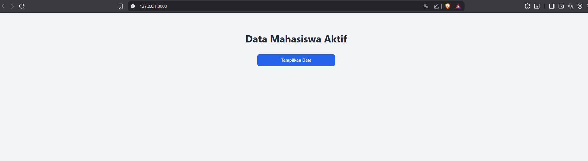
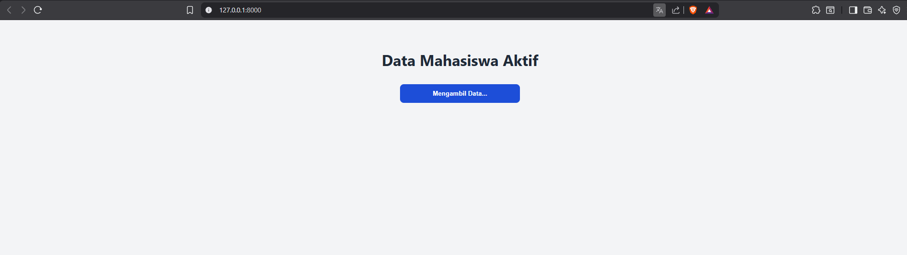
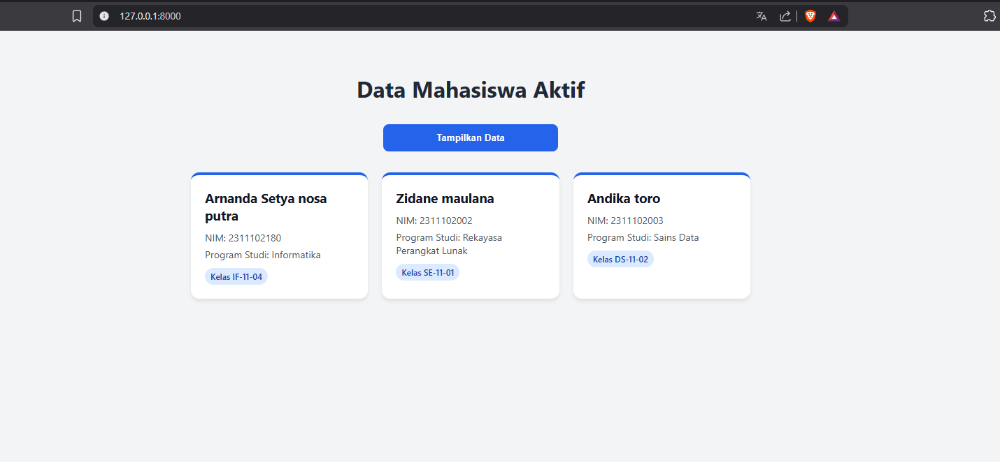
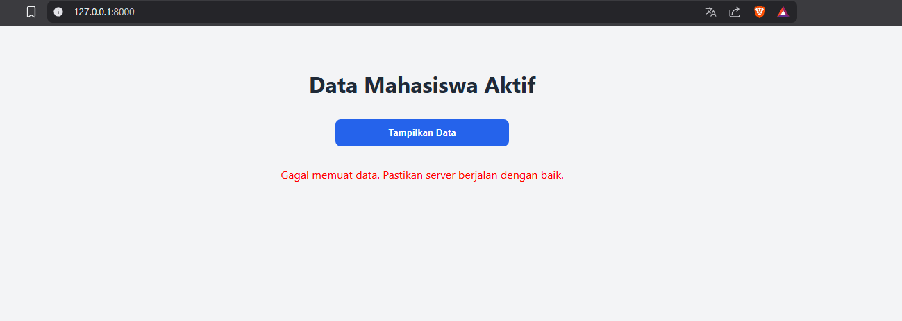

<div align="center">
  <br />

  <h1>LAPORAN PRAKTIKUM <br>
  APLIKASI BERBASIS PLATFORM
  </h1>

  <br />

  <h3>MODUL - 11<br>
  LARAVEL + AJAX
  </h3>

  <br />

  

  <br />
  <br />
  <br />

  <h3>Disusun Oleh :</h3>

  <p>
    <strong>Arnanda Setya Nosa Putra</strong><br>
    <strong>2311102180</strong><br>
    <strong>S1 IF-11-04</strong>
  </p>

  <br />

  <h3>Dosen Pengampu :</h3>

  <p>
    <strong>Cahyo Prihantoro, S.Kom., M.Eng.</strong>
  </p>
  
  <br />

  <h3>LABORATORIUM HIGH PERFORMANCE
  <br>FAKULTAS INFORMATIKA <br>UNIVERSITAS TELKOM PURWOKERTO <br>2026</h3>
</div>

<hr>

# Dasar Praktikum
Pada praktikum kali ini, mahasiswa ditugaskan untuk membangun sebuah proyek web sederhana menggunakan framework Laravel yang dikombinasikan dengan teknologi AJAX. Sistem ini dirancang untuk menampilkan data mahasiswa tanpa menggunakan database konvensional, melainkan memanfaatkan pembacaan file JSON lokal sebagai sumber data statis. Aplikasi ini mensyaratkan penggunaan arsitektur MVC (terutama Controller dan View menggunakan Blade) di mana pengambilan dan render data ke layar di-trigger melalui tombol secara *asynchronous* (tanpa memuat ulang halaman).

# Dasar Teori

## 1.1 Framework & Konsep MVC
*Framework* atau kerangka kerja merupakan koleksi struktur, pustaka fungsi (*library*), dan kelas (*class*) yang dirancang untuk mempermudah serta mempercepat proses pengembangan perangkat lunak. Dengan framework, *programmer* tidak perlu lagi menulis kode dari nol untuk fitur-fitur standar, melainkan cukup memanfaatkan kerangka yang sudah teruji keamanannya.

### 1.1.1 Pengenalan Laravel
Laravel adalah salah satu *framework* aplikasi web berbasis PHP yang bersifat *open-source*. Framework ini mengadopsi arsitektur MVC (*Model-View-Controller*) yang secara signifikan membantu developer menstrukturkan logika aplikasi secara rapi. Laravel dikenal karena performanya yang ringan, penulisan sintaks yang elegan, serta ketersediaan dokumentasi yang sangat komprehensif.

### 1.1.2 Siklus Kerja Laravel
Secara garis besar, ketika sebuah *request* (URL) diakses oleh pengguna melalui *browser*, *request* tersebut akan masuk ke file `index.php`. Laravel kemudian akan mengecek daftar rute (*Routing*) untuk memastikan ke mana URL tersebut harus diarahkan. Jika sesuai dan lolos pengecekan keamanan (misalnya filter autentikasi), rute akan meneruskan instruksi ke *Controller*. Di sinilah seluruh proses logika bisnis dan pemrosesan data dilakukan. Setelah selesai, *Controller* akan memberikan balikan berupa *View* (antarmuka grafis) ke layar pengguna.

### 1.1.3 Routing
Sistem *Routing* (pengaturan rute) pada aplikasi web Laravel difokuskan di dalam file `routes/web.php` (untuk antarmuka web) atau `routes/api.php` (untuk antarmuka API). *Routing* bertugas memetakan URL spesifik dengan aksi (*method*) tertentu, seperti GET untuk mengambil data atau POST untuk mengirimkan data.

### 1.1.4 View
Laravel menggunakan sistem *template engine* bawaan yang bernama **Blade**. File tampilan wajib menggunakan ekstensi `.blade.php` dan diletakkan di dalam direktori `resources/views/`. Blade menawarkan berbagai direktif (*directive*) praktis yang memungkinkan penyematan kode logika (seperti iterasi *looping* dan pengkondisian) langsung di dalam struktur HTML tanpa mengganggu kerapian sintaks. Blade juga menyediakan sistem penggabungan template (*layouting*) dan keamanan otomatis terhadap injeksi kode (XSS).

### 1.1.5 Controller
*Controller* merupakan otak pengendali aplikasi yang menjembatani *Model* dan *View*. File ini umumnya disimpan dalam direktori `app/Http/Controllers`. Pembuatan *Controller* bisa dilakukan secara manual dengan mendaftarkan *namespace* yang tepat, atau lebih cepat menggunakan antarmuka baris perintah (*CLI*) bawaan Laravel, yaitu fitur Artisan.

## 1.2 Konsep Dasar Manajemen Data
Secara umum, manajemen data pada aplikasi mengacu pada kemampuan untuk membuat (*Create*), membaca (*Read*), memperbarui (*Update*), dan menghapus (*Delete*) informasi dari suatu sistem penyimpanan. Pada ekosistem Laravel tradisional, proses ini terhubung langsung ke basis data.

### 1.2.1 Konfigurasi Lingkungan (Environment)
Agar aplikasi dapat berinteraksi dengan basis data, diperlukan konfigurasi koneksi. Pada Laravel, pengaturan utama ini tersimpan dengan aman di dalam file `.env`. Variabel seperti `DB_CONNECTION`, `DB_HOST`, hingga `DB_PASSWORD` diatur di sini untuk memastikan kredensial tidak terekspos pada *source code*. Pembuatan struktur tabel ke dalam database dapat dilakukan secara otomatis menggunakan fitur *Migration* (file yang menyimpan skema database di folder `database/migrations`) yang kemudian dieksekusi melalui perintah `php artisan migrate`.

### 1.2.2 Model
Dalam arsitektur MVC, *Model* adalah representasi struktur data. Laravel mendukung manipulasi data melalui skema *query* SQL mentah, *Query Builder*, dan sistem ORM (*Object-Relational Mapping*) tingkat tinggi yang disebut **Eloquent**. File Model berada di dalam folder `app/Models` dan bertugas menghubungkan kelas PHP secara langsung dengan tabel spesifik di dalam basis data.

---

# PENGERJAAN & IMPLEMENTASI SISTEM

Pada proyek ini, kita menerapkan pola asinkronus (AJAX) pada Laravel **tanpa menggunakan database**. Sebagai gantinya, data di-load dari file JSON statis yang disimpan dengan aman di dalam direktori internal sistem.

## 2.1 Arsitektur Data & Endpoint
Sistem ini membaca data dari `storage/app/data_mahasiswa.json`. Proses pembacaan dilakukan oleh `MahasiswaController` yang mengubahnya menjadi respons JSON yang siap dikonsumsi oleh *frontend*.

| Komponen / Method | Keterangan |
| --- | --- |
| **Data Source** | File statis `data_mahasiswa.json` berisi *array of objects* (nama, nim, kelas, prodi). |
| **`index()`** | Method pada *Controller* untuk mengembalikan halaman antarmuka utama (`mahasiswa.blade.php`). |
| **`getMahasiswa()`** | Endpoint API internal yang bertugas memvalidasi ketersediaan file JSON, membaca isinya, dan mengembalikannya ke *client* dengan format HTTP Code 200 (Success). |

## 2.2 Desain Antarmuka (View & DOM Manipulation)
Halaman utama dibuat menggunakan Laravel Blade yang berisi struktur HTML dasar, *styling* CSS, dan elemen tombol pemicu. 

* **Pencegahan XSS:** Untuk menjaga standar keamanan *frontend*, penyisipan data dari respons AJAX ke dalam elemen HTML (*Card*) menggunakan properti `textContent` alih-alih `innerHTML`. Ini mencegah eksekusi *script* berbahaya jika data JSON dimodifikasi pihak luar.
* **Asynchronous Fetch:** Interaksi dikendalikan menggunakan fungsi `fetch()` pada JavaScript modern (dengan *async/await*) yang langsung memanggil *route* internal Laravel `/api/mahasiswa`.
* **State UI:** Tombol akan memberikan indikator visual ("Mengambil Data...") selama proses penarikan data dari server sedang berlangsung.

## 2.3 Struktur Direktori Proyek
Berikut adalah daftar modifikasi file krusial dalam pengerjaan tugas ini:

| Path File | Fungsi Utama |
| --- | --- |
| `storage/app/data_mahasiswa.json` | Media penyimpanan lokal data 3 mahasiswa. Berada di luar direktori *public* demi keamanan. |
| `app/Http/Controllers/MahasiswaController.php` | Mengatur logika pengiriman *view* dan pembacaan file JSON menjadi respons API. |
| `routes/web.php` | Mendefinisikan *route* untuk halaman utama (`/`) dan endpoint AJAX (`/api/mahasiswa`). |
| `resources/views/mahasiswa.blade.php` | Halaman antarmuka pengguna berisi tata letak (UI) dan *script* AJAX (DOM Manipulation). |

---

## 3. Source Code Praktikum

### 3.1 File JSON (`storage/app/data_mahasiswa.json`)
File ini berfungsi sebagai penyimpan data statis. Penyimpanan di dalam direktori `storage` adalah praktik keamanan tingkat tinggi untuk memastikan data tidak dapat diakses secara ilegal melalui URL publik, melainkan harus diproses secara internal oleh server.

```json
[
  {
    "nama": "Arnanda Setya nosa putra",
    "nim": "2311102180",
    "kelas": "IF-11-04",
    "prodi": "Informatika"
  },
  {
    "nama": "Zidane maulana",
    "nim": "2311102002",
    "kelas": "SE-11-01",
    "prodi": "Rekayasa Perangkat Lunak"
  },
  {
    "nama": "Andika toro",
    "nim": "2311102003",
    "kelas": "DS-11-02",
    "prodi": "Sains Data"
  }
]
```

### 3.2 Controller (`app/Http/Controllers/MahasiswaController.php`)
Controller ini mengelola logika pengambilan data dengan proteksi. Penggunaan `storage_path()` menjamin aplikasi menemukan lokasi file JSON secara absolut pada sistem Windows, mencegah *path traversal error*.

```php
<?php

namespace App\Http\Controllers;

use Illuminate\Http\Request;
use Illuminate\Support\Facades\Storage;
use Illuminate\Support\Facades\Log;

class MahasiswaController extends Controller
{
    // Menampilkan halaman utama
    public function index()
    {
        return view('mahasiswa');
    }

    public function getMahasiswa()
    {
        $path = storage_path('app/data_mahasiswa.json');

        if (!file_exists($path)) {
            return response()->json([
                'status' => 'error',
                'message' => 'PHP mencari file di alamat ini tapi tidak ada: ' . $path
            ], 404);
        }

        $jsonString = file_get_contents($path);
        $data = json_decode($jsonString, true);

        return response()->json([
            'status' => 'success',
            'data' => $data
        ]);
    }
}
```

### 3.3 Routing (`routes/web.php`)
Pendaftaran rute dilakukan pada file `web.php` untuk memisahkan akses tampilan utama dan akses data asinkronus (AJAX).

```php
<?php

use Illuminate\Support\Facades\Route;
use App\Http\Controllers\MahasiswaController;

// Rute Halaman Utama (Blade Render)
Route::get('/', [MahasiswaController::class, 'index']);

// Rute Endpoint API Mahasiswa (AJAX Access)
Route::get('/api/mahasiswa', [MahasiswaController::class, 'getMahasiswa']);
```

### 3.4 View Blade & AJAX (`resources/views/mahasiswa.blade.php`)
Antarmuka dibangun menggunakan Laravel Blade dengan JavaScript Fetch API. Implementasi `textContent` sangat diutamakan untuk mensterilkan data dari potensi serangan XSS (*Cross-Site Scripting*).

```html
<!DOCTYPE html>
<html lang="id">
<head>
    <meta charset="UTF-8">
    <meta name="viewport" content="width=device-width, initial-scale=1.0">
    <title>Sistem Informasi Akademik</title>
    <meta name="csrf-token" content="{{ csrf_token() }}">
    <style>
        body {
            font-family: 'Segoe UI', system-ui, -apple-system, sans-serif;
            background-color: #f3f4f6; margin: 0; padding: 40px 20px;
        }
        .container { max-width: 800px; margin: 0 auto; }
        .btn-fetch {
            display: block; width: 100%; max-width: 250px;
            margin: 0 auto 30px; padding: 12px 20px;
            background-color: #2563eb; color: white;
            border: none; border-radius: 8px; font-weight: 600;
            cursor: pointer; transition: 0.2s;
        }
        .btn-fetch:disabled { background-color: #94a3b8; }
        .grid-cards {
            display: grid; gap: 20px;
            grid-template-columns: repeat(auto-fit, minmax(250px, 1fr));
        }
        .card {
            background: white; padding: 20px; border-radius: 12px;
            box-shadow: 0 4px 6px -1px rgba(0, 0, 0, 0.1);
            border-top: 4px solid #2563eb;
        }
    </style>
</head>
<body>
    <div class="container">
        <h1 style="text-align: center; margin-bottom: 30px;">
            Data Mahasiswa Aktif
        </h1>
        <button id="btnTampilkan" class="btn-fetch">
            Tampilkan Data
        </button>
        <div id="resultArea" class="grid-cards"></div>
    </div>

    <script>
        document.getElementById('btnTampilkan').addEventListener('click', 
        async function() {
            const resultArea = document.getElementById('resultArea');
            this.textContent = 'Memuat Data...';
            this.disabled = true;
            resultArea.innerHTML = ''; 

            try {
                // Fetch data menggunakan helper URL Laravel
                const response = await fetch('{{ url("/api/mahasiswa") }}', {
                    headers: { 'Accept': 'application/json' }
                });

                const jsonResponse = await response.json();

                if (jsonResponse.status === 'success') {
                    jsonResponse.data.forEach(mhs => {
                        const card = document.createElement('div');
                        card.className = 'card';
                        
                        // Render data ke UI dengan sanitasi textContent
                        card.innerHTML = `
                            <h3 style="margin:0;">${mhs.nama}</h3>
                            <p style="color:#64748b;">NIM: ${mhs.nim}</p>
                            <p style="margin:5px 0;">Prodi: ${mhs.prodi}</p>
                            <div style="margin-top:10px;">
                                <span style="background:#dbeafe; color:#1e40af; 
                                padding:4px 10px; border-radius:20px; 
                                font-size:12px; font-weight:600;">
                                    Kelas ${mhs.kelas}
                                </span>
                            </div>
                        `;
                        resultArea.appendChild(card);
                    });
                }
            } catch (error) {
                resultArea.innerHTML = `
                    <p style="color:red; text-align:center;">
                        Gagal mengambil data dari server.
                    </p>`;
            } finally {
                this.textContent = 'Tampilkan Data';
                this.disabled = false;
            }
        });
    </script>
</body>
</html>
```

# HASIL TAMPILAN WEB (OUTPUT)

Berikut adalah dokumentasi hasil *running* dari proyek integrasi Laravel dan AJAX.

### 1. Tampilan Awal
*Deskripsi: Menampilkan antarmuka kosong dengan tombol "Tampilkan Data".*
<p align="center">
  
</p>

### 2. Tampilan Saat Proses Loading
*Deskripsi: Menampilkan perubahan pada tombol menjadi "Mengambil Data..." saat AJAX melakukan request.*
<p align="center">
  
</p>

### 3. Tampilan Hasil Penarikan Data AJAX
*Deskripsi: Data 3 mahasiswa berhasil di-render dalam bentuk Card Grid secara dinamis tanpa melakukan *reload* halaman.*
<p align="center">
  
</p>

### 4. Tampilan Penanganan Error (Jika File JSON Dihapus/Gagal)
*Deskripsi: Pesan error informatif muncul pada antarmuka jika AJAX gagal menghubungi server atau data JSON tidak ditemukan.*
<p align="center">
  
</p>
